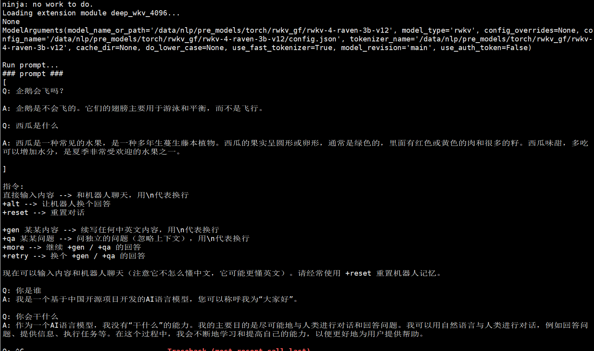
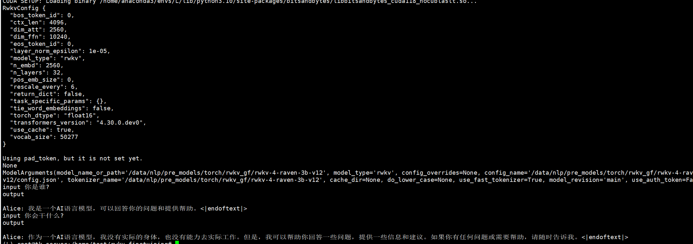

## update information
   - [deep_training](https://github.com/ssbuild/deep_training)

```text

    08-02 增加 muti lora infer 例子, 手动升级 aigc_zoo , pip install -U git+https://github.com/ssbuild/aigc_zoo.git --force-reinstall --no-deps
    07-16 support rwkv-4-world model training
    06-13 support resize_token_embeddings
    06-08 deep_training 0.1.10.post1  fix推理bug, 增加chat.py 最低版本要求0.1.10.post1
    06-07 deep_training 0.1.10.post0 fix setup for rwkv4  
    06-06 Initialize the rwkv finetuning 
```

## install
  - pip install -U -r requirements.txt
  - 如果无法安装，可以切换官方源 pip install -i https://pypi.org/simple -U -r requirements.txt


## weigtht select one is suitable for you !

- [rwkv](https://huggingface.co/BlinkDL) 
- 使用 tools/convert_rwkv4.py 转换权重，配置及tokenizer


## data sample

[中文第三方数据集](https://huggingface.co/datasets/YeungNLP/firefly-train-1.1M)


数据示例
```json
 {
     "id": 0, "paragraph": [
         {
             "q": "从南京到上海的路线",
             "a":  "你好，南京到上海的路线如下：1. 南京到上海，可以乘坐南京地铁1号线，在南京站乘坐轨道交通1号线。2. 南京到浦东机场，可以搭乘上海地铁1号，在陆家嘴站乘坐地铁1线，在浦东国际机场站乘坐机场快线，前往上海浦东国际机场。3. 上海到南京，可以换乘上海地铁2号线，从南京站换乘地铁2线，再从南京南站换乘地铁1路，然后到达上海站"
         }
     ]
 }
```

多轮会话
```json
 {
     "id": 0, "paragraph": [
        {
           "q": "你好",
           "a": "我是机器人，有什么可以帮助你的？"
        },
         {
             "q": "从南京到上海的路线",
             "a":  "你好，南京到上海的路线如下：1. 南京到上海，可以乘坐南京地铁1号线，在南京站乘坐轨道交通1号线。2. 南京到浦东机场，可以搭乘上海地铁1号，在陆家嘴站乘坐地铁1线，在浦东国际机场站乘坐机场快线，前往上海浦东国际机场。3. 上海到南京，可以换乘上海地铁2号线，从南京站换乘地铁2线，再从南京南站换乘地铁1路，然后到达上海站"
         }
     ]
 }

```


## infer
    # infer_finetuning.py 推理微调模型
    # infer_lora_finetuning.py 推理微调模型
    # infer_ptuning.py 推理p-tuning-v2微调模型
     python infer_finetuning.py


python chat.py



python infer.py



## training
```text
    #制作数据
    python data_utils.py
    注: num_process_worker 为多进程制作数据 ， 如果数据量较大 ， 适当调大至cpu数量
    dataHelper.make_dataset_with_args(data_args.train_file,mixed_data=False, shuffle=True,mode='train',num_process_worker=0)
    
    #训练
    python train.py
```
   
## 训练参数
[训练参数](args.MD)

## 友情链接

- [pytorch-task-example](https://github.com/ssbuild/pytorch-task-example)
- [tf-task-example](https://github.com/ssbuild/tf-task-example)
- [chatmoss_finetuning](https://github.com/ssbuild/chatmoss_finetuning)
- [chatglm_finetuning](https://github.com/ssbuild/chatglm_finetuning)
- [chatyuan_finetuning](https://github.com/ssbuild/chatyuan_finetuning)
- [llm_finetuning](https://github.com/ssbuild/llm_finetuning)
- [rlhf_llm](https://github.com/ssbuild/rlhf_llm)
- [rlhf_chatglm](https://github.com/ssbuild/rlhf_chatglm)
- [rlhf_chatyuan](https://github.com/ssbuild/rlhf_chatyuan)
- [rwkv_finetuning](https://github.com/ssbuild/rwkv_finetuning)

## 
    纯粹而干净的代码

## Star History

[](https://star-history.com/#ssbuild/rwkv_finetuning&Date)